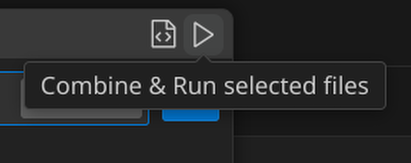

# PICO-8 Toolkit 

A Visual Studio Code extension that displays the current token usage across your entire PICO-8 project directory. Ideal for keeping track of the 8192 token limit in multi-file `.p8` projects.

Allows combining multiple .p8 source files down into a single combined cartridge for an easier development workflow. 

Includes a bindable `Compile & Run` command to easily run your merged `.p8` file in PICO-8 without leaving your IDE.

---

## Features

- ✅ Live token counting across all `.p8` files in the workspace
- ✅ Accurate parsing using rules aligned with PICO-8 tokenization
- ✅ Displays token count in the status bar
- ✅ Hovering the status bar shows a detailed breakdown by file
- ✅ Automatically updates when files are changed, opened, or saved
- ✅ Interactive file selector to include/exclude files from token totals
- ✅ Merge selected `.p8` files into a single output file with the `Compile` command 
- ✅ Displays each file as a unique tab in the internal editor of PICO-8 
- ✅ Supports running PICO-8 directly from the IDE with the `Run` command
- ✅ `Compile & Run` command to merge and run in one step
- ✅ `Stop` command to terminate the currently running PICO-8 process

Status bar display:

Tooltip display:

Dialogue display:

Combine files tooltip:

Run cartridge tooltip:

---

## Usage
- Select Files for Compilation and Token Tracking
    - Click the token count in the status bar, or run PICO-8: Select Files from the Command Palette.
    - Use the checkboxes to select .p8 files.
    - Click the toolbar icon or run PICO-8: Compile to merge selected files together.

- Configure Quick Compilation
    - Set pico8.outputPath in your settings:
        - Use a directory path to be prompted for a filename.
        - Use a full .p8 file path to save directly (overwrites without confirmation).
    - Set pico8.pico8Path to the full path of your PICO-8 binary (e.g. /home/user/apps/pico8/pico8).

- Commands
    - PICO-8: Compile – Merge selected files into one .p8
    - PICO-8: Run – Launch PICO-8 with the output file (Raw file only)
    - PICO-8: Compile and Run – Merge and run in one step (Strips `#include` statements and appends `--->8` separators)
    - PICO-8: Stop – Stop the currently running PICO-8 process

---

## Requirements

- VS Code 1.77+  
- .p8 files must be placed in the working directory or any of its children 

No additional dependencies required.

---

## License

[Attribution 4.0 International (CC BY 4.0)](https://creativecommons.org/licenses/by/4.0/)  
You are free to use, modify, and share the code within this project, with credit. This license does not extend to or include the icon, which is the intellectual property of ([@redowul](https://github.com/redowul)).

---

## Author

Created by [@redowul](https://github.com/redowul)
