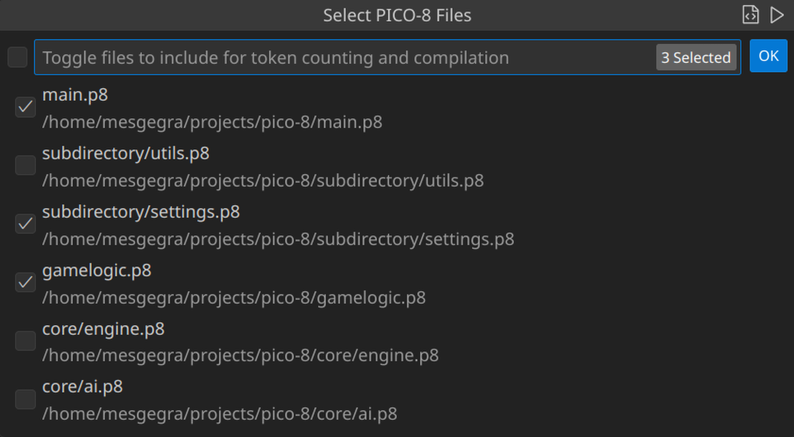

# PICO-8 Toolkit 

A Visual Studio Code extension that displays the current token usage across your entire PICO-8 project directory. Ideal for keeping track of the 8192 token limit in multi-file `.p8` projects.

Allows combining multiple .p8 source files down into a single combined cartridge for an easier development workflow. 

---

## Features

- ✅ Live token counting across all `.p8` files in the workspace
- ✅ Accurate parsing using rules aligned with PICO-8 tokenization
- ✅ Displays token count in the status bar
- ✅ Hovering the status bar shows a detailed breakdown by file
- ✅ Automatically updates when files are changed, opened, or saved
- ✅ Interactive file selector to include/exclude files from token totals
- ✅ Compile selected `.p8` files into a single output file
- ✅ Toolbar button to auto-generate a combined file with `-- 8>` tabs per section
- ✅ Optional quick compile command with preconfigured output path

Status bar display:

Tooltip display:

Dialogue display:

Combine files tooltip:

---

## Usage

To select files for inclusion in token tracking and compilation:

1. Click the status bar token count or run `PICO-8: Select Files` from the Command Palette.
2. Use the checkboxes to toggle files.
3. Use the toolbar icon to combine selected files into one `.p8`.

To enable quick compilation:

1. Set a value for `pico8Directory.outputPath` in your VS Code settings.
2. Run `PICO-8: Auto Compile` (optionally bind a key for fast use).

---

## Requirements

- VS Code 1.77+  
- .p8 files must be placed in the working directory or any of its children 

No additional dependencies required.

---

## Release Notes

### 1.2.0

- Token count now calculates the sum of all selected .p8 files, regardless of directory
- Combined file export now strips `#include` statements from output

### 1.1.0

- Add interactive file selector UI
- Add file combination and export to `.p8`
- Add `--->8` separator for combined output
- Add support for auto-compiling to a preset path

### 1.0.0

- Initial release
- Live token tracking and status bar output
- Breakdown tooltip with right-aligned counts

---

## License

[Attribution 4.0 International (CC BY 4.0)](https://creativecommons.org/licenses/by/4.0/)  
You are free to use, modify, and share the code within this project, with credit. This license does not extend to or include the icon, which is the intellectual property of (@redowul).

---

## Author

Created by [@redowul](https://github.com/redowul)
